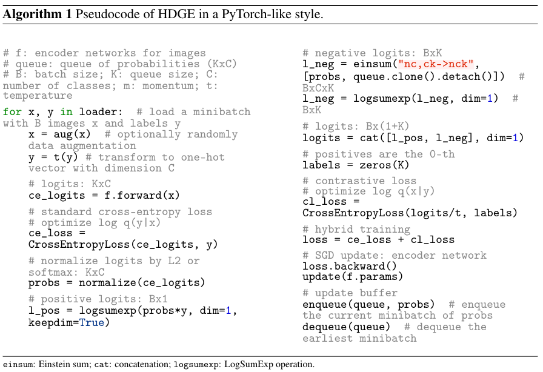

This is the official code for the paper [Hybrid Discriminative-Generative Training via Contrastive Learning](http://arxiv.org/abs/2007.09070).


This is code is built upon the official code of the great work [JEM](https://github.com/wgrathwohl/JEM).

> Contrastive learning and supervised learning have both seen significant progress and success.  However, thus far they have largely been treated as two separate objectives, brought together only by having a shared neural network.  In this paper we show that through the perspective of hybrid discriminative-generative training of energy-based models we can make a direct connection between contrastive learning and supervised learning.
> Beyond presenting this unified view, we show our specific choice of approximation of the energy-based loss outperforms the existing practice in terms of classification accuracy of WideResNet on CIFAR-10 and CIFAR-100. It also leads to improved performance on robustness, out-of-distribution detection, and calibration.




Includes codes and scripts for training UDGE and baselines using WideResNet.

For any questions/issues please contact hao.liu@cs.berkeley.edu.

## Usage
The experiment environemnt is provided in [this conda env](udge.yaml).
### Training
To train a model on CIFAR10 as in the paper
```markdown
# UDGE: log q(y|x) + log q(x|y)
python train_wrn_ebm.py --lr .0001 --dataset cifar10 --optimizer adam --pyxce 1.0 --pxycontrast 1.0 --sigma .03 --width 10 --depth 28 --warmup_iters 1000 --log_dir ./save --id YOUR_EXP_ID

# UDGE: log q(x|y)
python train_wrn_ebm.py --lr .0001 --dataset cifar10 --optimizer adam --pxycontrast 1.0 --sigma .03 --width 10 --depth 28 --warmup_iters 1000 --log_dir ./save --id YOUR_EXP_ID

# JEM: log q(y|x) + log q(x)
python train_wrn_ebm.py --lr .0001 --dataset cifar10 --optimizer adam --pyxce 1.0 --pxsgld 1.0 --sigma .03 --width 10 --depth 28 --warmup_iters 1000 --log_dir ./save --id YOUR_EXP_ID

# UDGE + marginal likelihood: log q(y|x) + log q(x|y) + log q(x) (for generative tasks)
python train_wrn_ebm.py --lr .0001 --dataset cifar10 --optimizer adam --pyxce 1.0 --pxycontrast 1.0 --pxsgld 1.0 --sigma .03 --width 10 --depth 28 --warmup_iters 1000 --log_dir ./save --id YOUR_EXP_ID
```
***NOTE***


You can use the [viskit](viskit) from [this open souce code](https://github.com/vitchyr/viskit) to track the experiment progress.

Stay tuned for pretrained model and distributed code that scales better.


### Evaluation

To generate a histogram of calibration error
```markdown
python eval_wrn_ebm.py --load_path /PATH/TO/YOUR/MODEL.pt --eval eval_ece --dataset cifar100test --log_dir /YOUR/HIST/FOLDER
```
To generate a histogram of OOD scores
```markdown
python eval_wrn_ebm.py --load_path /PATH/TO/YOUR/MODEL.pt --eval logp_hist --datasets cifar10 svhn --log_dir /YOUR/HIST/FOLDER
```
To evaluate the classifier accuracy (on CIFAR10):
```markdown
python eval_wrn_ebm.py --load_path /PATH/TO/YOUR/MODEL.pt --eval test_clf --dataset cifar_test
```
To do OOD detection (on CIFAR100)
```markdown
python eval_wrn_ebm.py --load_path /PATH/TO/YOUR/MODEL.pt --eval OOD --ood_dataset cifar100
```
To generate new unconditional samples
```markdown
python eval_wrn_ebm.py --load_path /PATH/TO/YOUR/MODEL.pt --eval uncond_samples --log_dir /YOUR/SAVE/DIR --n_sample_steps {THE_MORE_THE_BETTER (1000 minimum)} --buffer_size 10000 --n_steps 40 --print_every 100 --reinit_freq 0.05
```
To generate new conditional samples
```markdown
python eval_wrn_ebm.py --load_path /PATH/TO/YOUR/MODEL.pt --eval cond_samples --log_dir /YOUR/SAVE/DIR --n_sample_steps {THE_MORE_THE_BETTER (1000 minimum)} --buffer_size 10000 --n_steps 40 --print_every 10 --reinit_freq 0.05 --fresh_samples
```


### Acknowledgement

This code is based on [this open source implementation](https://github.com/wgrathwohl/JEM). The UDGE model is adapted from [this open source code](https://github.com/facebookresearch/moco).
